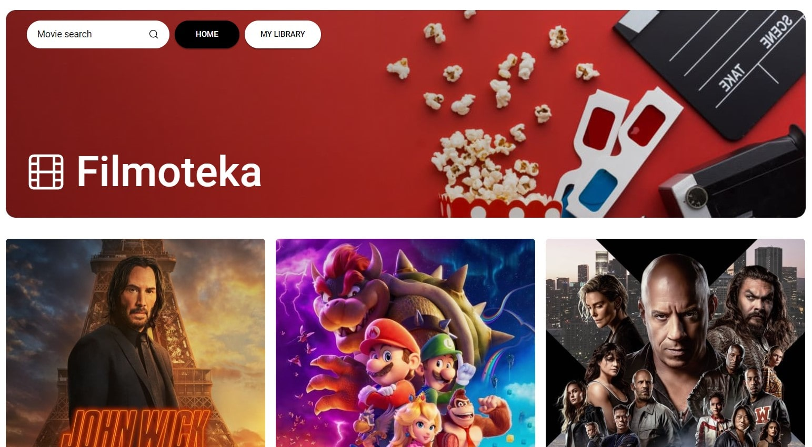
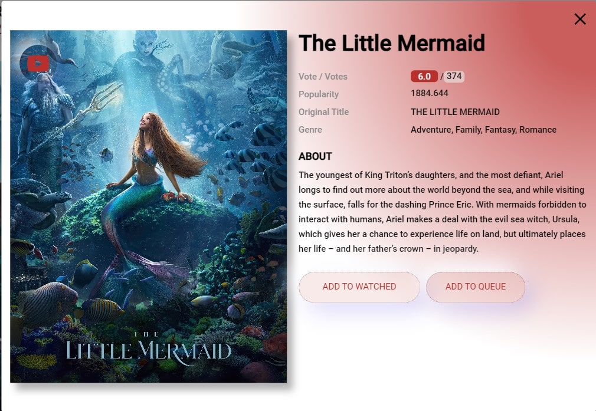
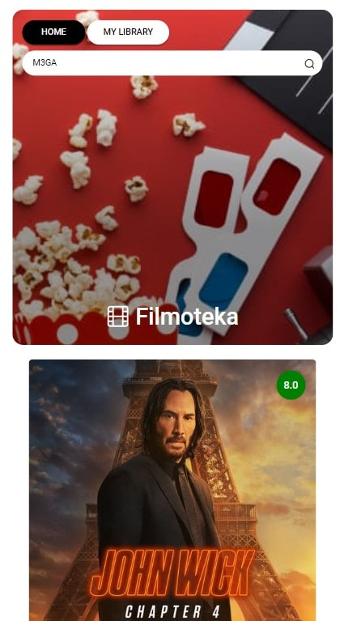

# COMMAND PROJECT FILMOTEKA

The main goal of the project was to create a user-friendly and visually appealing website where users can choose a movie for solitary viewing, a night with friends, or a cozy evening with a loved one. We wanted our site to be intuitive for every user, leaving no questions about how to use it. Users are provided with a list of top-recommended movies, with the ability to read the synopsis and choose a movie to their liking.  

**Timeframe:** 8 days 19 hours  

## Our Team

**Team Lead:** Nikita Lan  

**Scrum Master:** Yevheniia Melnychenko  

**Project Mentor:** Nataliia Valkan  

**Developers:**  
- Oleksandr Afanasiev  
- Kostiantyn Koshyk  
- Yuliia Ishchenko  
- Olha Bahrii  
- Anna Nastenko  
- Iryna Tsariuk  
- Oleksii Leshchenko  
- Zakhar Tsarapov  
- Artem Osypov  

## MAIN SITE FUNCTIONALITY

- Eye-pleasing design  
- Ability to watch a movie trailer directly on the site by selecting a card  
- Option to add a movie to a personal "watched" or "queue" list  
- Fully responsive design for all devices  
- Search functionality by movie title  

  
  
  

## Surprise

There’s also a hidden surprise (Easter egg) on the site. Try to find it!  

**Hint:** One of the team members hid the surprise. Find their name and surname 😉  
